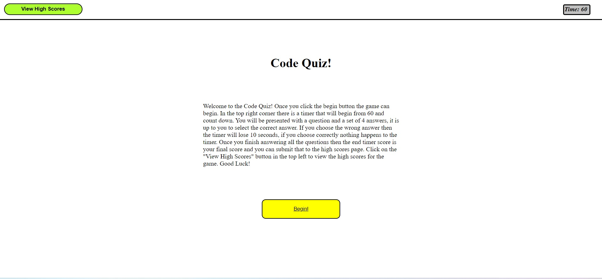

# Coding-Quiz

## Introduction
In this project I created a coding quiz game, with a bunch of simple rules. The rules include: you have 60 seconds to answer all the questions on the screen (6 questions) and for every question you guess incorrectly, then 10 seconds will be taken off the timer. Once all questions are answered the timer is stopped and the final registered time is your final score. The higher the score, the better!

## Functionality
Most of the pages are created through using JQUERY and accessing the DOM to create elements and assign them attributes. Content is also added by using logic and algorithms that I created so most of the values and text assignment can be done automatically in the code, reducing time for programmers to assign the text and values.

### Timer
The timer of the game begins once the "Begin" button is clicked and 60 seconds starts to tick down. Using a setInterval function to decrease the time at a rate of 1 second. There is an if/ else if statement within the function that checks if the timer reaches 0 (based on incorrect scores reducing the time to 0 or the user running out of time) and if it has then this automatically changes pages to the final score page to input their score. If the timer didn't reach 0 but the player completed the quiz then the timer is stopped and that time left is saved a the users final score.

### View High Scores
The view high scores button on the main page will redirect the user to a separate html file. Within the high scores page there are a couple of different sections.
#### Back Button
The back button uses a standard anchor attribute so once it is clicked then the user is taken back to the home page.
#### View Scores
Once clicked, the view scores button will use the JSON object retrieval method to search in the local storage and parse the string back into values. These values are reassigned into variables and then appended to the unordered list within the DOM. These are shown up on screen.

### The Quiz
Using a variable that is assigned to a name which is based on the current page that is shown. When the next page is presented, that variable is then changed to match that current page. This is used as a "pageLooper" which helps switch pages.
#### Begin Button
On the introduction page there is a begin button, once clicked it then assigns the current page variable from "intro" to "questionOne". This then triggers the first question creation and calls the timer function to begin counting down.
#### The Questions
Each question has the same function, which is triggered once the "pageLooper" calls it after the answers are guessed. The question functions use the empty() function to clear elements from the page, allowing the calling for other functions to then create the question and answer buttons and append them to the screen.
#### The Answers
Each question page has a set of buttons that will be created and appended. Once appended they are then sent to another function which assigns the text and value to them. This is done for each question through an automatic function I created to save the time for the programmer to individually assign each button for each question the text and value.
#### Guessing
When the user takes a guess and clicks on a button, the buttons use event listeners to then call a function. This function takes the value of the button clicked and then compares it to the correct answer (input manually by me). The user answer and correct answer are then sent to a function to check if their guess was correct or incorrect.
#### Correct/Incorrect
The right or wrong function takes in the users guess and the correct answer. It compares the two using an if/else statement. If the user guessed correctly then the next page is shown and they are told it was a correct guess. If the user guessed incorrectly then the next page is shown and they are told it was incorrect guess, as well as 10 seconds being taken off of the clock.

### Final Score
Once the user has run out of time or finished answering the questions, they are presented with the final score page. On this page the user is shown their final score (calculated by how much time was left). They are then offered the opportunity to input their initials and click the submit button. The submit button then uses a listener to send the initials and final score into the local storage, using the JSON stringify object. This is where the code will be able to retrieve this information for the high scores page. From this page, the user can click on "View High Scores" to see their score.

## Screenshot

## URL Deployed Site